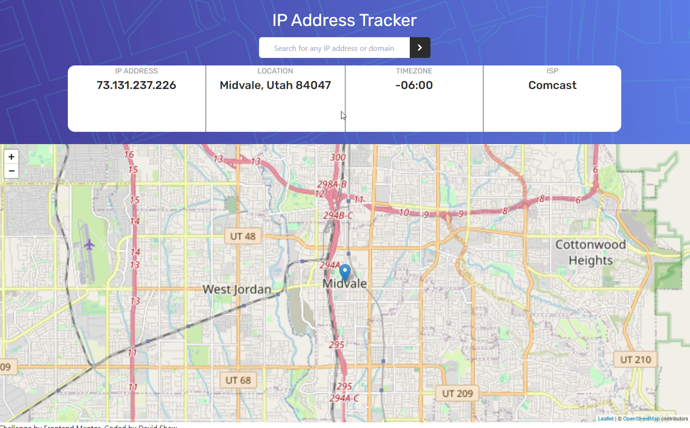

# Frontend Mentor - IP address tracker solution

This is a solution to the [IP address tracker challenge on Frontend Mentor](https://www.frontendmentor.io/challenges/ip-address-tracker-I8-0yYAH0). Frontend Mentor challenges help you improve your coding skills by building realistic projects. Still working on some of the styling for this project as well as converting it a React project.

## Table of contents

- [Overview](#overview)
  - [The challenge](#the-challenge)
  - [Screenshot](#screenshot)
  - [Links](#links)
- [My process](#my-process)
  - [Built with](#built-with)
  - [Continued development](#continued-development)
- [Author](#author)

**Note: Delete this note and update the table of contents based on what sections you keep.**

## Overview

### The challenge

Users should be able to:

- View the optimal layout for each page depending on their device's screen size
- See hover states for all interactive elements on the page
- See their own IP address on the map on the initial page load
- Search for any IP addresses or domains and see the key information and location

### Screenshot
 

 ### Links

- Solution URL: [GitHub Repo](https://github.com/ds1242/ip-simple)
- Live Site URL: [Github Live Site](https://ds1242.github.io/ip-simple/)

### Continued development

Plan to turn this into a React app version.  Better mobile sizing going forward.

### Built With
- HTML5
- TailwindCSS
- Custom CSS properties
- Vanilla JS

## Author
David Shaw